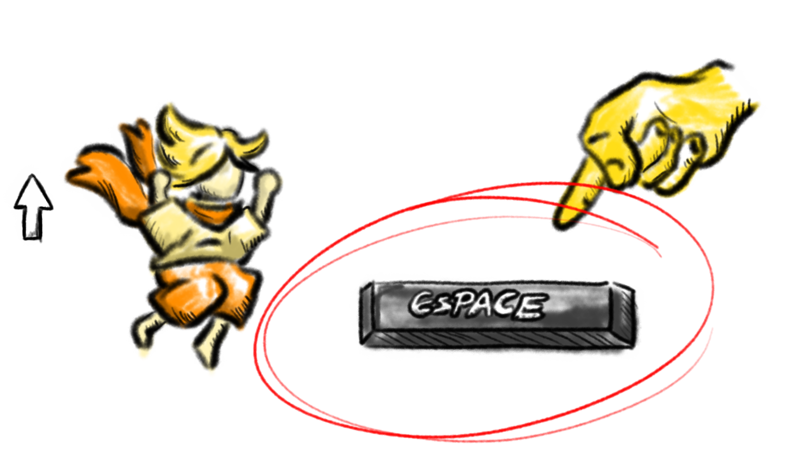

# 🎮 Commandes 

## 🚶 Se déplacer

Utilisez les touches _**ZQSD**_. 

Si vous utilisez un clavier QWERTY, WASD est automatiquement pris en charge.

## 🎥 Contrôler la camera

Déplacez la _**Souris**_ 🖱️pour regarder autour de vous.

## 🦘 Sauter

Pour sauter, il suffit s'appuyer sur la touche _**Espace**_.

Prolongez l'appui pour sauter plus haut.

[//]: # (</img>)

[//]: # (![long jump image]&#40;./img/long_jump.png&#41;)

## 🕊️ Planer

Maintenez la touche **_Shift gauche_** pour flotter dans les airs. 

[//]: # (![hovering image]&#40;./img/hovering.png&#41;)

## 🌠 Lancer du sable

Maintenez le _**clic gauche**_ de la souris pour projeter du sable, et interagir avec certains éléments.

[//]: # (![mouse image]&#40;./img/mouse.png&#41;)

## 🖱️ Interagir lors d'un dialogue

Utilisez le **_clic gauche_** de la souris pour passer au dialogue suivant.

## ⭐ Démarrer un niveau

Appuyez sur la touche **_F_**, à proximité d'un rêve.

## ⏸️ Menu pause

Appuyez sur la touche **_Entrée_**.

